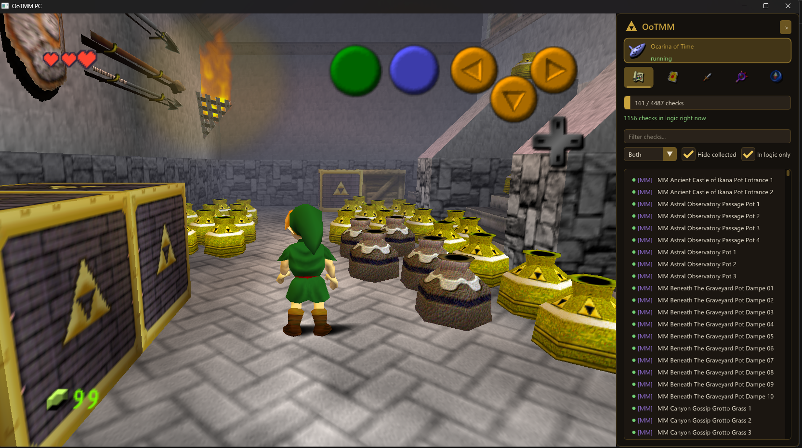
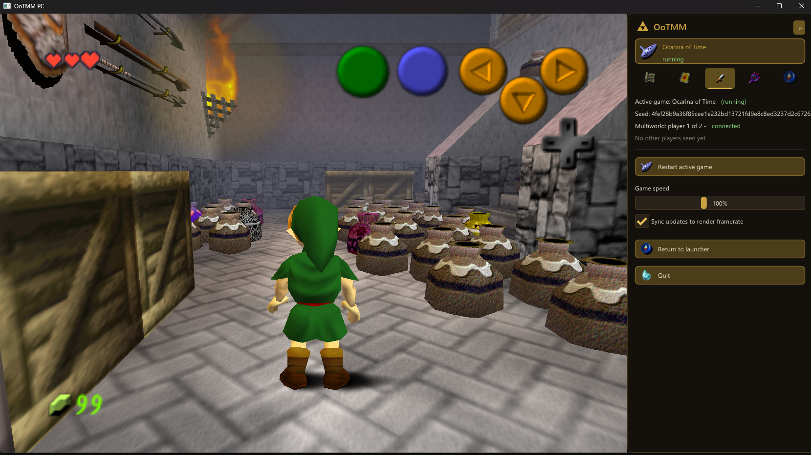
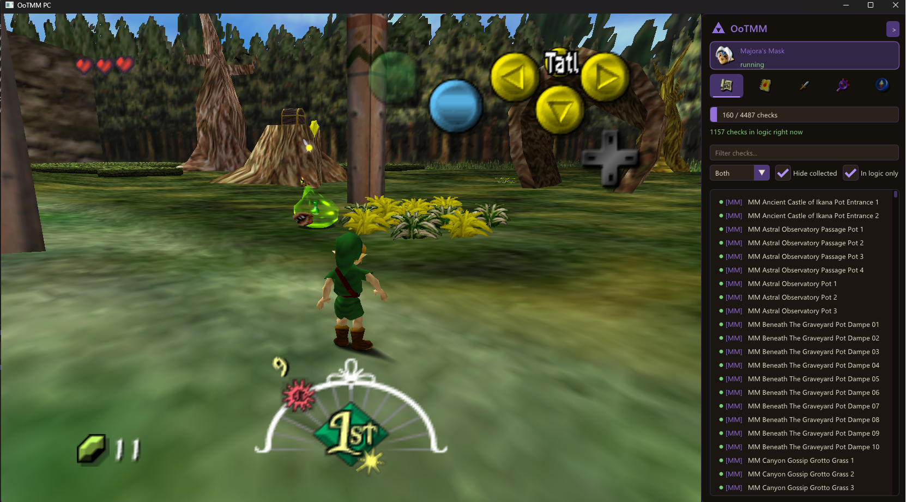

# OoTMM PC

A native PC implementation of [OoTMM](https://ootmm.com), the Ocarina of Time × Majora's Mask
combo randomizer, built on the [Ship of Harkinian](https://github.com/HarbourMasters/Shipwright)
(OoT) and [2 Ship 2 Harkinian](https://github.com/HarbourMasters/2ship2harkinian) (MM) ports.

One seed spans both games: checks in either game can hold items from the other, progress is
shared, and cross-game load zones (the Happy Mask Shop portal, warp songs, Song of Soaring)
hand you off between the two games seamlessly. Multiworld seeds connect multiple players
through a relay server.

## Screenshots

**OOT**



**OOT Post Agony**



**MM**



## Layout

| Path | Contents |
| --- | --- |
| `src/ootmm` | `ootmm_core` — the shared coordinator runtime compiled into both ports and the launcher: seed loading, the check/grant ledger, cross-game item routing, the packet bridge, boot configuration |
| `src/launcher` | The GUI launcher: a pre-launch config screen (seed, game paths, mods, multiworld) and a runtime manager hosting the game window with a live check tracker, in-logic availability solver, session controls and per-game settings |
| `src/server` | `ootmm_server` — a dedicated headless multiworld relay for always-on hosting (clients are roomed by seed; default port 42801) |
| `external/Shipwright` | OoT port with the OoTMM integration (submodule, branch `ootmm`) |
| `external/2ship2harkinian` | MM port with the OoTMM integration (submodule, branch `ootmm`) |
| `external/OoTMM` | The OoTMM generator with the PC-seed export pipeline (submodule, branch `ootmm`) |
| `tests/` | `ootmm_core` unit tests and coordinator harnesses |
| `tools/` | Asset pipeline: foreign item-model mod builder, launcher icon generator |
| `samples/` | Example PC-seed files and a generator config sample |

## Building

Requires CMake and a C++20 compiler (Visual Studio on Windows).

```sh
git clone --recurse-submodules <this repo>
cmake -B build
cmake --build build --config Debug --target ootmm_launcher ootmm_server
```

The game ports are built from their own trees (`external/Shipwright`, `external/2ship2harkinian`)
following each port's build instructions; both link `ootmm_core` from this repository.

## Playing

1. Generate a PC seed (`.ootmm.json`) with the generator in `external/OoTMM`
   (`packages/generator/lib/pc-seed-cli.ts`, or the generator web UI).
2. Run `ootmm_launcher`, pick the seed and your `soh.exe` / `2ship.exe` builds, and start.
3. For multiworld, either check "host relay" in the launcher or point every player at a
   machine running `ootmm_server`.

You must provide your own legally obtained Ocarina of Time and Majora's Mask ROMs to set up
the ports; no game assets are included in or distributed by this repository.
